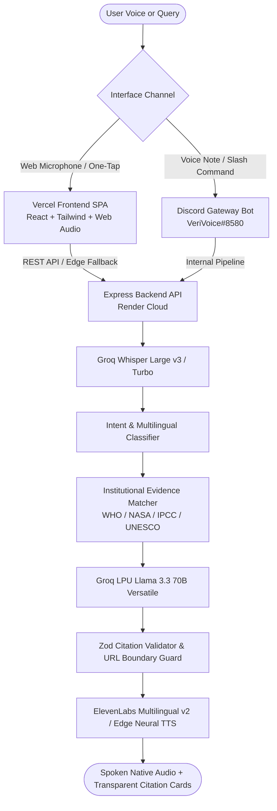

# 🎙️ VeriVoice — Voice-First Multilingual Verification & Research Assistant

[](LICENSE)
[](tests/)
[](docs/architecture.md)
[](https://unesco.org)
[](https://verivoice-unesco.vercel.app)
[](https://render.com)

> **VeriVoice** is an evidence-grounded, voice-first multilingual assistant engineered in alignment with UNESCO Media & Information Literacy (MIL) principles. It empowers vulnerable communities to verify rumors, research complex health & climate questions, and receive natural spoken responses in their native languages.

---

## 🌐 Live Demonstrations

| Platform | Access Link | Description |
|---|---|---|
| 🖥️ **Web Application (Vercel)** | [**verivoice-ten.vercel.app**](https://verivoice-ten.vercel.app) / [**verivoice-unesco.vercel.app**](https://verivoice-unesco.vercel.app) | Full hands-free Voice Sanctuary with real-time Acoustic Core and one-tap judge demo inquiries. |
| 🤖 **Discord Bot (Cloud)** | [**Invite VeriVoice Bot**](https://discord.com/api/oauth2/authorize?client_id=1537205576809840702&permissions=101376&scope=bot%20applications.commands) | 24/7 cloud Discord bot with `/verify`, `/general`, `/mil`, `/voice`, and native voice note processing. |
| 📂 **Documentation** | [**docs/README.md**](docs/README.md) | Comprehensive engineering documentation, architecture diagrams, and security specifications. |

---

## 📌 The Problem & Solution

Fact-checking tools often fail non-English speakers and vulnerable populations because they rely on dense text articles and assume high digital media literacy. When rumors spread via voice notes in group chats, users have no easy way to check what they hear.

**VeriVoice** closes this gap with a complete **voice-in, voice-out verification loop**:
$$\text{Voice Input} \longrightarrow \text{ASR Transcription} \longrightarrow \text{Evidence Retrieval} \longrightarrow \text{Structured Reasoning} \longrightarrow \text{Spoken Verdict}$$

---

## 🌟 Core Features

1. **Acoustic Core & Voice Sanctuary**: Real-time canvas audio visualization responding to user microphone decibels and speech barge-in interruption.
2. **Dual Intelligence Modes**:
   - **Verification Mode (`/verify`)**: Evaluates rumors against institutional evidence (`TRUE`, `FALSE`, `MIXED`, `UNCERTAIN`).
   - **General Research Mode (`/general`)**: Explains complex scientific, health, and environmental topics directly with authoritative evidence citations.
3. **Multilingual Speech & Script**: Native support for **Urdu (اردو)**, **English**, **Spanish (Español)**, and **Indonesian (Bahasa Indonesia)**.
4. **Primary Institutional Authority Mapping**: Ranks verified repositories (WHO, UNICEF, CDC, NASA, IPCC, WMO, UNESCO) over secondary blogs.
5. **Multi-Key Resilient Fallback Pool**:
   - **LLM**: 5 Groq keys rotating across `Llama 3.3 70B`, `Llama 3.1 8B`, `Qwen 3.6 27B`, and `GPT OSS 120B`.
   - **TTS**: 5 ElevenLabs keys with automatic failover to Microsoft Edge Neural TTS (`ur-PK-UzmaNeural`).
6. **Defense-in-Depth Security**: Strict CSP, frame denial, CORS origin isolation, 30 req/min rate limits, XML prompt injection boundaries, and Zod citation validation.

---

## 📐 System Architecture



---

## 🚀 Quick Start (Local Development)

### 1. Prerequisites
- Node.js 18+ (Node.js 20+ recommended)
- Git

### 2. Clone & Install
```bash
git clone https://github.com/HamzaKhanBUIC/Veri-Voice-Unesco-Hackathon.git
cd Veri-Voice-Unesco-Hackathon

# Install root dependencies
npm install

# Install frontend dependencies
npm --prefix frontend install
```

### 3. Environment Variables
Copy `.env.example` to `.env` and fill in your API credentials:
```bash
cp .env.example .env
```

### 4. Run Development Servers
```bash
# Run backend API
npm run dev

# In a separate terminal, run frontend SPA
npm run dev:frontend
```
Open [http://localhost:5173](http://localhost:5173) in your browser.

---

## 🧪 Test Suite

VeriVoice includes an extensive automated test suite covering security, speech synthesis, conversational context, and citation grounding:

```bash
# Run all 21 test suites (170 tests)
npm test
```

```
Test Suites: 21 passed, 21 total
Tests:       170 passed, 170 total
Snapshots:   0 total
Time:        10.021 s
```

---

## 📁 Repository Structure

```
.
├── backend/                  # Express REST API, services & Discord client
│   ├── src/
│   │   ├── app.js            # Security middleware, CORS & routes
│   │   ├── server.js         # Entry point & Discord Gateway lifecycle
│   │   ├── services/
│   │   │   ├── speech/       # Whisper ASR provider
│   │   │   ├── tts/          # ElevenLabs & Edge-TTS providers
│   │   │   ├── verification/ # Groq LLM & CitationValidator
│   │   │   └── discord/      # Discord Bot handlers & slash commands
├── frontend/                 # React 18 SPA (Vite + Tailwind CSS)
│   ├── src/
│   │   ├── components/       # Acoustic Core visualizer, Evidence Drawer
│   │   ├── pages/            # Voice Sanctuary (Talk), Research (Chat)
│   │   └── services/api/     # Multi-key resilient API client
├── docs/                     # Comprehensive technical documentation
│   ├── README.md             # Documentation master index
│   ├── architecture.md       # Detailed technical architecture
│   ├── security.md           # Security & abuse mitigation
│   ├── privacy.md            # Ephemeral data & privacy policy
│   ├── deployment.md         # Vercel & Render cloud runbooks
│   ├── api.md                # REST API schemas & endpoints
│   └── discord.md            # Discord slash commands & bot invite
├── analysis/                 # Authoritative verification reports & audits
│   ├── final/                # Production audits & benchmark reports
│   └── archive/              # Historical sprint development logs
├── scripts/                  # Automated verification & diagnostic runners
└── tests/                    # 21 Jest unit & integration test suites
```

---

## 🔒 Security & Privacy Policy

- **Zero Permanent Audio Storage**: Voice recordings are processed in memory and unlinked immediately.
- **Strict Citation Boundary**: The model is prohibited from generating URLs not present in the verified institutional dataset.
- **Prompt Injection Isolation**: User inputs are enclosed inside `<USER_CLAIM>` XML tags to prevent prompt hijacking.

Read our full [Security Policy](docs/security.md) and [Privacy Policy](docs/privacy.md).

---

## 📄 License
This project is licensed under the [MIT License](LICENSE).