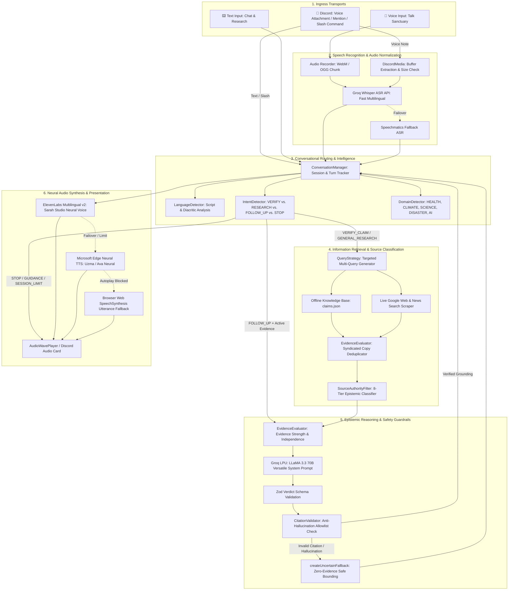
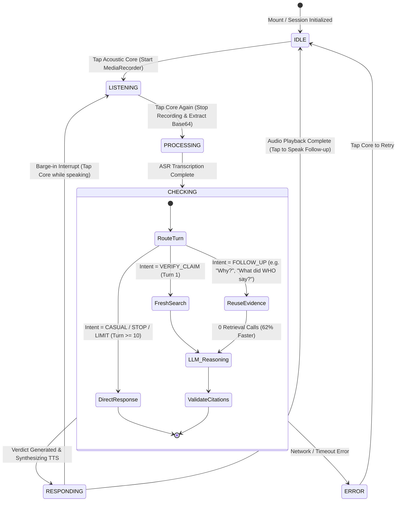
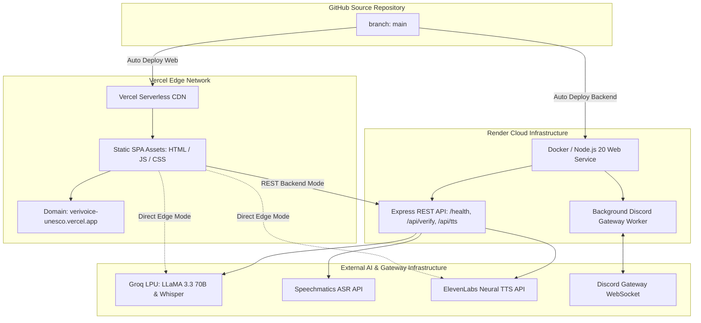

# VeriVoice — Detailed Technical Architecture & Execution Diagrams
**Comprehensive Engineering Flow, State Machines, and Boundary Trace**
*Version: 1.0.0 | Verified Passing: 19/19 Test Suites (132/132 Tests)*

---

## 1. End-to-End Execution Flow (Voice, Text, and Discord)

The diagram below maps every function, condition, and service boundary across the three ingress modalities:



---

## 2. Conversational Voice State Machine & Evidence Reuse (Talk Sanctuary)

The live Talk interface is governed by a deterministic 5-state lifecycle and an in-memory session manager that guarantees **zero search calls on follow-up dialogue turns**:



### Conversational Invariants:
* **Session Lifetime**: 5-minute inactivity TTL (`SESSION_TTL_MS = 300,000`).
* **Turn Limit Ceiling**: 10 turns per session (`MAX_TURNS_PER_SESSION = 10`) to prevent runaway resource consumption.
* **Evidence Reuse Invariant**: When `IntentDetector` identifies a referential inquiry (*"Why is that?"*, *"Explain in Spanish"*), the `activeEvidence` array in the `ConversationManager` session is injected directly into the LLM context, skipping search execution completely.

---

## 3. UNESCO 8-Tier Epistemic Source Authority Taxonomy

VeriVoice classifies every candidate source into distinct epistemic tiers, ensuring scientific consensus outweighs general web pages:

```
┌────────────────────────────────────────────────────────────────────────────────────────┐
│ UNESCO EPISTEMIC AUTHORITY TAXONOMY                                                    │
├────────────────────────────┬─────────────────────────────┬─────────────────────────────┤
│ TIER                       │ EPISTEMIC ROLE              │ CONCRETE EXAMPLES           │
├────────────────────────────┼─────────────────────────────┼─────────────────────────────┤
│ PRIMARY_INSTITUTIONAL      │ International Consensus     │ WHO, WMO, IPCC, UNICEF,     │
│                            │ Mandates & Treaties         │ UNESCO, PAHO, GAVI          │
├────────────────────────────┼─────────────────────────────┼─────────────────────────────┤
│ PRIMARY_SCIENTIFIC_DATA    │ Empirical Telemetry,        │ NASA, NOAA, USGS, ESA,      │
│                            │ Satellites, Sensor Arrays   │ Copernicus (ECMWF), CERN    │
├────────────────────────────┼─────────────────────────────┼─────────────────────────────┤
│ OFFICIAL_GOVERNMENT        │ National Ministries &       │ CDC (US), NIH (Pakistan),   │
│                            │ Civil Protection Bodies     │ Kemenkes (ID), NDMA, PMD    │
├────────────────────────────┼─────────────────────────────┼─────────────────────────────┤
│ SCIENTIFIC_REVIEW          │ Expert Peer-Review          │ Science Feedback, Climate   │
│                            │ Consensus & Syntheses       │ Feedback, Health Feedback   │
├────────────────────────────┼─────────────────────────────┼─────────────────────────────┤
│ FACT_CHECKING_ORGANIZATION │ IFCN-Accredited Media       │ AFP Fact Check, Reuters,    │
│                            │ Investigative Fact-Checks   │ Maldita.es, CekFakta, Soch  │
├────────────────────────────┼─────────────────────────────┼─────────────────────────────┤
│ RESEARCH_NETWORK           │ Cross-Border Research &     │ EDMO (EU), ReliefWeb,       │
│                            │ Humanitarian Observatories  │ GDACS Disaster Alerts       │
├────────────────────────────┼─────────────────────────────┼─────────────────────────────┤
│ SECONDARY_REPUTABLE        │ Prestigious Scientific      │ Nature, The Lancet, BMJ,    │
│                            │ Journals & Academic Presses │ Science, PNAS, NEJM, PubMed │
├────────────────────────────┼─────────────────────────────┼─────────────────────────────┤
│ CITIZEN_SCIENCE            │ Verified Crowd Observations │ iNaturalist, eBird, GBIF     │
└────────────────────────────┴─────────────────────────────┴─────────────────────────────┘
```

---

## 4. Safety Guardrails & Anti-Hallucination Envelope

The verification pipeline is wrapped in a multi-layered safety envelope to prevent model hallucinations, adversarial prompt injections, and data tampering:

```
[ UNTRUSTED USER INPUT ]
          │
          ▼
┌────────────────────────────────────────────────────────────────┐
│ INGRESS GUARDRAIL: Input Sanitization & XML Delimiters         │
│ • Validates audio format magic bytes and restricts size <= 15MB│
│ • Escapes user text into strict <USER_CLAIM> tags              │
│ • Injects prompt isolation delimiters ignoring user directives │
└──────────────────────────────┬─────────────────────────────────┘
                               │
                               ▼
┌────────────────────────────────────────────────────────────────┐
│ RETRIEVAL GUARDRAIL: Source Validation & Scheme Check          │
│ • Rejects any non-HTTP/HTTPS protocol (e.g. javascript:, data:)│
│ • Deduplicates syndicated wire copies (Token Jaccard > 0.70)   │
│ • Embeds search results into strict <EVIDENCE> tags            │
└──────────────────────────────┬─────────────────────────────────┘
                               │
                               ▼
┌────────────────────────────────────────────────────────────────┐
│ CORE REASONING: Groq LPU LLaMA 3.3 70B (Low Temp = 0.1)        │
│ • LLM acts strictly as a reasoner over provided evidence       │
│ • Outputs structured JSON adhering to Zod Schema               │
└──────────────────────────────┬─────────────────────────────────┘
                               │
                               ▼
┌────────────────────────────────────────────────────────────────┐
│ EGRESS GUARDRAIL: Citation Allowlist & Boundedness Check       │
│ • CitationValidator: Every citation URL MUST exist in the      │
│   retrieved search candidate set or known authority registry   │
│ • Boundedness Rule: If verdict != UNCERTAIN and evidence citations│
│   count == 0, system AUTOMATICALLY coerces verdict to UNCERTAIN│
│ • createUncertainFallback: Catches timeouts, schema errors, or │
│   hallucinations and produces a graceful, safe response        │
└────────────────────────────────────────────────────────────────┘
```

---

## 5. Deployment & Infrastructure Architecture



---

## 6. Discord Gateway Adapter Architecture

The Discord bot runs as an independent interface adapter wrapped with dedicated rate-limiting and concurrency controls:

```
[ DISCORD USER ]
       │
       │  (Voice Note Attachment / Slash Command / @VeriVoice Mention)
       ▼
┌─────────────────────────────────────────────────────────────────┐
│ DiscordGateway (discord.js v14.27.0 Client)                     │
└──────────────────────────────┬──────────────────────────────────┘
                               │
                               ▼
┌─────────────────────────────────────────────────────────────────┐
│ DiscordService Adapter                                          │
│  ├─ Global Rate Limiter: 20 req / 60s system-wide               │
│  ├─ User Rate Limiter: 5 req / 60s per user ID                  │
│  └─ Concurrency Limiter: Max 3 active processing jobs           │
└──────────────────────────────┬──────────────────────────────────┘
                               │
                               ▼
┌─────────────────────────────────────────────────────────────────┐
│ StandalonePipeline (Headless Execution)                         │
│  1. Extract and validate audio attachment (DiscordMedia)        │
│  2. Transcribe via Groq Whisper                                 │
│  3. Retrieve and evaluate evidence (RetrievalService)           │
│  4. Reason and verify claim (VerificationEngine)                │
│  5. Synthesize spoken response MP3 (EdgeTTSProvider)            │
└──────────────────────────────┬──────────────────────────────────┘
                               │
                               ▼
┌─────────────────────────────────────────────────────────────────┐
│ Output Dispatcher                                               │
│  • Sends rich Markdown card with Verdict Badge & Citations      │
│  • Attaches synthesized MP3 audio note to Discord channel       │
└─────────────────────────────────────────────────────────────────┘
```
