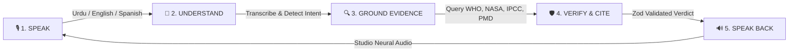

# VeriVoice — Product Architecture Overview & Systems Map
**Executive & Architectural Briefing for Judges, Developers, and Users**
*Aligned with UNESCO Media & Information Literacy (MIL) Standards*

---

## 1. 30-Second Pitch & Product Architecture (For Judges)

VeriVoice is a **voice-first, multilingual, evidence-grounded claim verification and research platform** designed to combat medical, climate, and scientific misinformation in underserved global languages.

Unlike conversational chatbots that generate answers from static weights, **VeriVoice separates reasoning from truth data**: it retrieves authoritative institutional evidence in real-time, validates source credibility across an 8-tier epistemic taxonomy, reasons strictly over cited evidence, and speaks the verdict aloud in authentic local languages.

```
                                  ┌────────────────────────────────────────┐
                                  │               VERIVOICE                │
                                  │   Multilingual Voice Verification Core │
                                  └───────────────────┬────────────────────┘
                                                      │
                       ┌──────────────────────────────┼──────────────────────────────┐
                       │                              │                              │
                       ▼                              ▼                              ▼
            ┌─────────────────────┐        ┌─────────────────────┐        ┌─────────────────────┐
            │    WEB INTERFACE    │        │     DISCORD BOT     │        │   HEADLESS CLI / QA │
            │  Talk (Voice) & Chat│        │   Voice Notes & /cmd│        │  Test Suite (19/19) │
            └──────────┬──────────┘        └──────────┬──────────┘        └──────────┬──────────┘
                       │                              │                              │
                       └──────────────────────────────┼──────────────────────────────┘
                                                      ▼
                                  ┌────────────────────────────────────────┐
                                  │        CONVERSATION & ROUTING          │
                                  │ Language • Intent • Evidence Reuse Ref │
                                  └───────────────────┬────────────────────┘
                                                      │
                       ┌──────────────────────────────┼──────────────────────────────┐
                       │                              │                              │
                       ▼                              ▼                              ▼
            ┌─────────────────────┐        ┌─────────────────────┐        ┌─────────────────────┐
            │   VOICE SANCTUARY   │        │   GENERAL RESEARCH  │        │ FACT VERIFICATION   │
            │ Multi-turn Dialogue │        │ Deep Explanations   │        │ TRUE / FALSE / MIXED│
            └──────────┬──────────┘        └──────────┬──────────┘        └──────────┬──────────┘
                       │                              │                              │
                       └──────────────────────────────┼──────────────────────────────┘
                                                      ▼
                                  ┌────────────────────────────────────────┐
                                  │   HYBRID RETRIEVAL & AUTHORITY TIER    │
                                  │ 8-Tier UNESCO Taxonomy • Deduplication │
                                  └───────────────────┬────────────────────┘
                                                      │
                                                      ▼
                                  ┌────────────────────────────────────────┐
                                  │       REASONING & CITATION CHECK       │
                                  │ Groq LLaMA 3.3 70B • Anti-Hallucination│
                                  └───────────────────┬────────────────────┘
                                                      │
                                                      ▼
                                  ┌────────────────────────────────────────┐
                                  │     TRIPLE-TIER NEURAL AUDIO (TTS)     │
                                  │  ElevenLabs • Edge Neural • Web Speech │
                                  └────────────────────────────────────────┘
```

---

## 2. The User Journey: From Voice to Verified Truth

A normal user experiences a seamless, frictionless 4-step loop:



1. **SPEAK**: The user taps the pulsing Acoustic Core and speaks in their mother tongue (e.g. *"کیا پولیو کے قطرے محفوظ ہیں؟"* or *"Is the Earth flat?"*).
2. **UNDERSTAND**: Real-time ASR converts the audio into text; language detectors recognize the dialect and intent.
3. **GROUND EVIDENCE**: The system searches verified repositories (WHO, UNICEF, CDC, NASA, IPCC, NDMA, Kemenkes).
4. **VERIFY & CITE**: The reasoning engine evaluates the claim against the facts, producing an unambiguous verdict (`TRUE`, `FALSE`, `MIXED`, or `UNCERTAIN`) with legitimate citations.
5. **SPEAK BACK**: The response is synthesized in a warm, articulate female voice in the user's native language.

---

## 3. Data Flow & Trust Boundary Map

VeriVoice enforces a strict zero-trust boundary: **all user inputs, search results, and external web texts are treated as untrusted data** until they pass cryptographic and structural safety guardrails.

```
┌─────────────────────────────────────────────────────────────────────────────────────────────┐
│ UNTRUSTED EXTERNAL ZONE (Untrusted Inputs & Raw Web Data)                                    │
│  • User Microphone Stream / Base64 Audio                                                    │
│  • User Text Input (Potential prompt injection / jailbreak attempts)                        │
│  • Raw Web Search Results (Scraped HTML, syndicated wire copies, unverified blogs)           │
└──────────────────────────────────────────────┬──────────────────────────────────────────────┘
                                               │
                                      [ INGRESS DEFENSES ]
                                      • Magic-byte Audio Validation
                                      • Character Limit & Regex Stripping
                                      • XML Delimiter Tagging (<USER_CLAIM>, <EVIDENCE>)
                                               │
                                               ▼
┌─────────────────────────────────────────────────────────────────────────────────────────────┐
│ VERIVOICE TRUSTED EXECUTION CORE (Protected Environment)                                    │
│                                                                                             │
│   ┌───────────────────────────────────────────────────────────────────────────────────────┐ │
│   │ 1. Conversational Routing & Memory Manager                                            │ │
│   │    • 10-turn session quota ceiling (Prevents infinite loops)                          │ │
│   │    • 5-minute inactivity TTL memory cleanup                                           │ │
│   │    • Token-bucket rate limiting (5 req/min per user, 20 req/min system-wide)          │ │
│   └──────────────────────────────────────────┬────────────────────────────────────────────┘ │
│                                              ▼                                              │
│   ┌───────────────────────────────────────────────────────────────────────────────────────┐ │
│   │ 2. Epistemic Evidence Filter & Classification                                         │ │
│   │    • UNESCO 8-Tier Authority Taxonomy Classification                                  │ │
│   │    • Syndicated Wire Copy Deduplication (Token Jaccard > 0.70)                        │ │
│   │    • Scheme Validation (Permits ONLY http: and https: protocols)                      │ │
│   └──────────────────────────────────────────┬────────────────────────────────────────────┘ │
│                                              ▼                                              │
│   ┌───────────────────────────────────────────────────────────────────────────────────────┐ │
│   │ 3. Isolated LLM Reasoning Engine (Groq LPU LLaMA 3.3 70B Versatile)                   │ │
│   │    • Instructed to evaluate claim SOLELY using bounded evidence tags                  │ │
│   │    • Outputs strictly structured JSON schemas                                         │ │
│   └──────────────────────────────────────────┬────────────────────────────────────────────┘ │
│                                              ▼                                              │
│   ┌───────────────────────────────────────────────────────────────────────────────────────┐ │
│   │ 4. Post-Execution Safety Guardrails                                                   │ │
│   │    • Zod Verdict Schema Validation (`validateVerdict`)                                │ │
│   │    • Citation Validator (Rejects any URL not in retrieved candidate set)              │ │
│   │    • Strict Boundedness Fallback (Forces UNCERTAIN if non-uncertain has 0 citations)  │ │
│   └───────────────────────────────────────────────────────────────────────────────────────┘ │
│                                              │                                              │
└──────────────────────────────────────────────┼──────────────────────────────────────────────┘
                                               ▼
┌─────────────────────────────────────────────────────────────────────────────────────────────┐
│ TRUSTED OUTPUT ARTIFACTS                                                                    │
│  • Verified Verdict Badge (`TRUE` / `FALSE` / `MIXED` / `UNCERTAIN` / `RESEARCH_RESPONSE`)  │
│  • Validated Institutional Citations with Authority Level Badges                            │
│  • Multi-Tier Neural Audio Stream (`ElevenLabs` / `Edge Neural` / `Web Speech`)             │
└─────────────────────────────────────────────────────────────────────────────────────────────┘
```

---

## 4. Controlled vs. External Services Matrix

| Layer | Component | Controlled by VeriVoice | External Dependency | Failover / Resilience Mechanism |
|---|---|:---:|:---:|---|
| **User Interface** | Web Talk Sanctuary & Chat | ✅ Yes (React/Vite) | Edge CDN (Vercel) | Full offline / client-side Direct Groq LPU mode |
| **Interface Adapter** | Discord Bot Gateway | ✅ Yes (`DiscordService`) | Discord API | In-memory queue with rate and concurrency limiting |
| **Ingress ASR** | Speech-to-Text | ❌ Provider | Groq Whisper / Speechmatics | Groq Whisper $\rightarrow$ Speechmatics $\rightarrow$ Mock ASR |
| **Routing & Context** | Conversation Manager | ✅ Yes (`ConversationManager`) | None (In-memory) | Client context synchronization via persistent ref |
| **Information Retrieval** | Query Strategy & Search | ✅ Yes (`RetrievalService`) | Google Search API | Offline `claims.json` $\rightarrow$ Live Web Search $\rightarrow$ Safe Empty |
| **Source Authority** | 8-Tier Taxonomy Filter | ✅ Yes (`SourceAuthorityFilter`) | None (Pure Logic) | Deterministic fallback classification |
| **Epistemic Reasoning**| LLM Reasoning Engine | ❌ Provider | Groq LPU (LLaMA 3.3 70B) | Multi-key rotation $\rightarrow$ `createUncertainFallback` |
| **Guardrails & Safety**| Citation & Schema Checks | ✅ Yes (`CitationValidator`) | None (Zod / Logic) | Automatic coercion to safe `UNCERTAIN` verdict |
| **Voice Output** | Audio Synthesis (TTS) | ❌ Provider | ElevenLabs / Microsoft Edge | ElevenLabs $\rightarrow$ Edge Neural $\rightarrow$ Web SpeechSynthesis |
