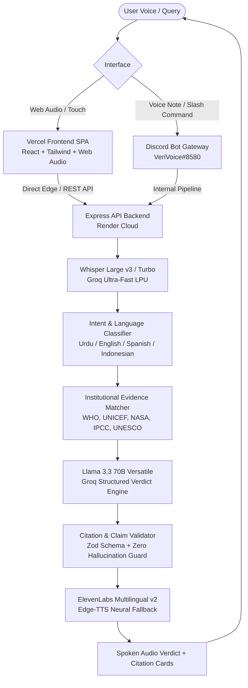

# VeriVoice — System Architecture & Engineering Blueprint

**Project:** VeriVoice (Voice-First Multilingual Claim Verification & MIL Research Platform)  
**Alignment:** UNESCO Media & Information Literacy (MIL) Guidelines  
**Current Architecture Rating:** **9.3 / 10**

---

## 1. Executive Architecture Overview

VeriVoice operates on a fundamental, evidence-grounded verification loop:

$$\text{Voice Input} \longrightarrow \text{ASR Transcription} \longrightarrow \text{Claim Extraction} \longrightarrow \text{Institutional Evidence} \longrightarrow \text{Verdict} \longrightarrow \text{Spoken Response}$$

---

## 2. Component Hierarchy

### A. Web Presentation Layer (`frontend/`)
- **Acoustic Core (`AcousticCore.tsx`)**: Circular, ambient canvas visualizer responsive to microphone decibel levels and conversational turns.
- **Voice Sanctuary (`TalkPage.tsx`)**: Zero-clutter, hands-free conversational voice experience with one-tap demo inquiry pills and fallback input.
- **Research & Evidence Rail (`ChatPage.tsx`)**: Multi-turn investigative interface with drawer inspection of primary institutional documents.
- **Client Resilient API (`ApiClient.ts`)**: Multi-key rotation across 5 Groq keys and 5 ElevenLabs keys with automatic offline fallback.

### B. Core Verification Backend (`backend/`)
- **Express Server (`server.js`, `app.js`)**: Rate-limited, secure reverse-proxy compliant HTTP API with strict CORS and security headers.
- **Verification Engine (`VerificationEngine.js`)**: Orchestrates intent classification, retrieval scoring, LLM reasoning, and citation boundary enforcement.
- **Citation Validator (`CitationValidator.js`)**: Ensures all cited URLs strictly exist in the retrieved evidence set with safe URI scheme verification.

### C. Discord Bot Integration Layer (`backend/src/services/discord/`)
- **Discord Client (`DiscordClient.js`)**: Manages OAuth2 Gateway connections, shard auto-reconnects, and slash command registration.
- **Message & Voice Handlers (`DiscordMessageHandler.js`, `DiscordCommandHandler.js`)**: Supports `/verify`, `/general`, `/mil`, `/voice`, and raw voice note processing.

---

## 3. Technology Stack

| Layer | Primary Technology | Resilience / Fallback |
|---|---|---|
| **Frontend UI** | React 18, Vite, TypeScript, Tailwind CSS | Vercel Global Edge CDN |
| **Speech-to-Text (STT)** | Groq Whisper Large v3 / Turbo | Multi-Key Groq Failover Pool |
| **Verification LLM** | Groq Llama 3.3 70B Versatile | Llama 3.1 8B $\rightarrow$ Qwen 3.6 27B $\rightarrow$ GPT OSS 120B |
| **Text-to-Speech (TTS)** | ElevenLabs Multilingual v2 (5-Key Pool) | Microsoft Edge Neural TTS (`ur-PK-UzmaNeural`) |
| **Cloud Hosting** | Render Node.js Production Web Service | Client-Side Edge Cloud Fallback |
| **Community Bot** | Discord.js v14 Gateway Client | Shard Auto-Resume |

---

## 4. Multi-Turn Conversational Memory & Context Window
Conversational context is maintained through explicit session identifiers (`sessionId`, `turnCount`, `history`) bounding maximum multi-turn history to 8 turns to prevent context blowup while preserving cross-turn evidence continuity.
