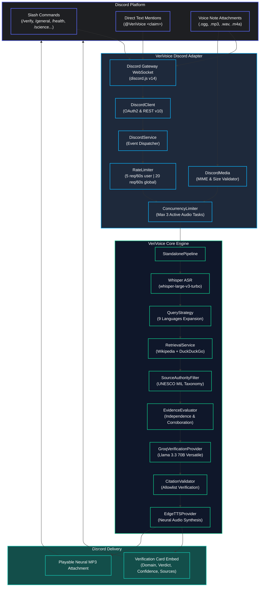
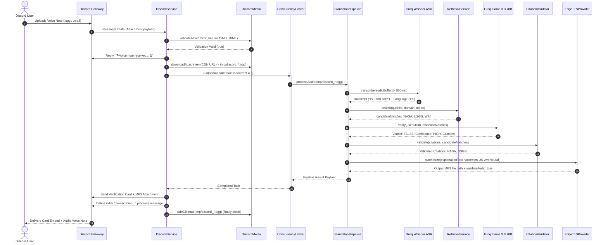
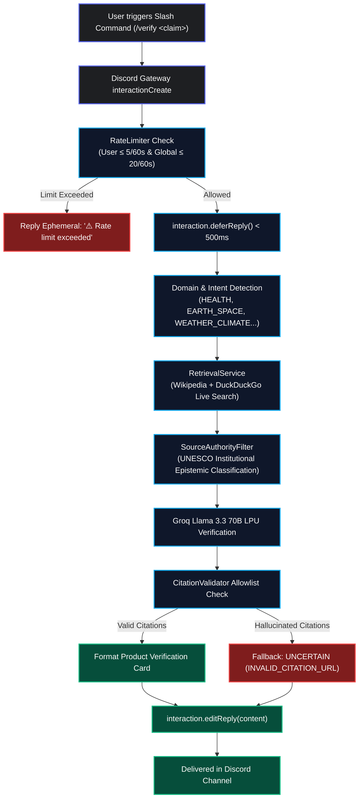
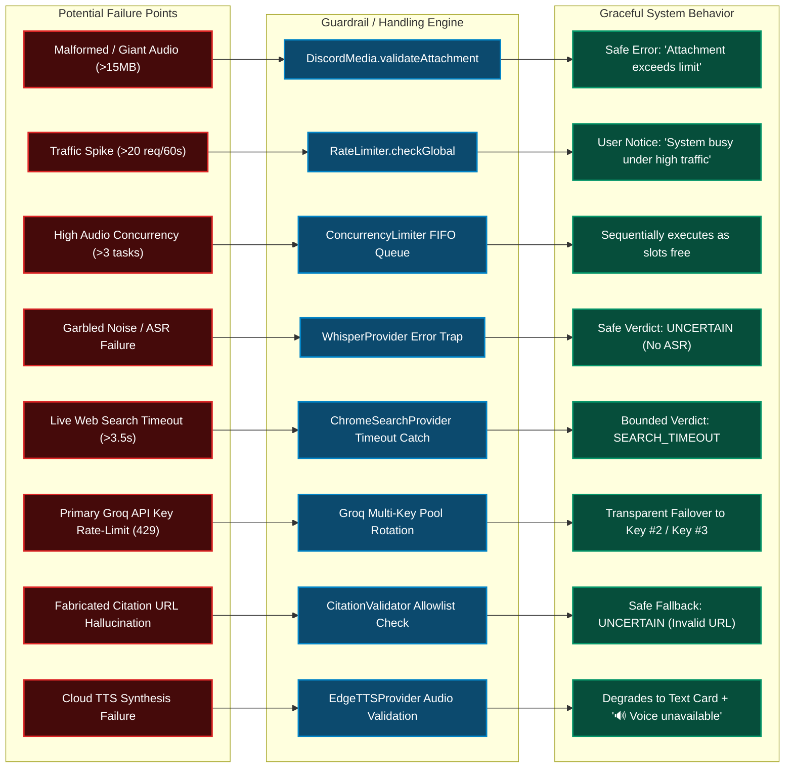
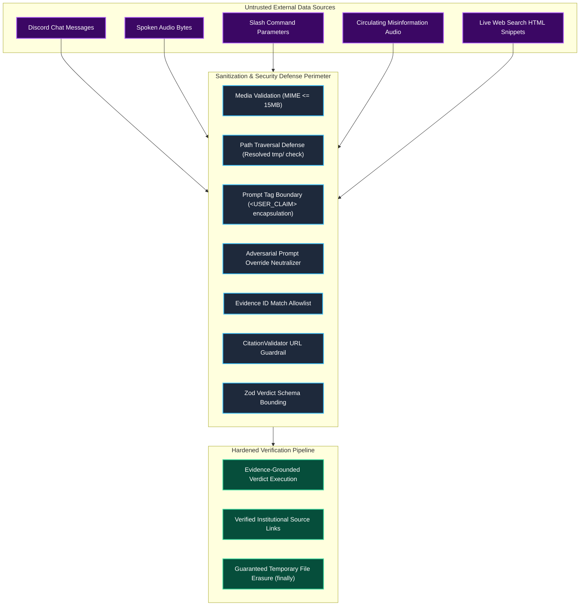
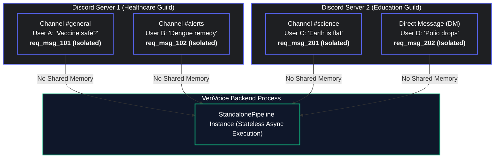
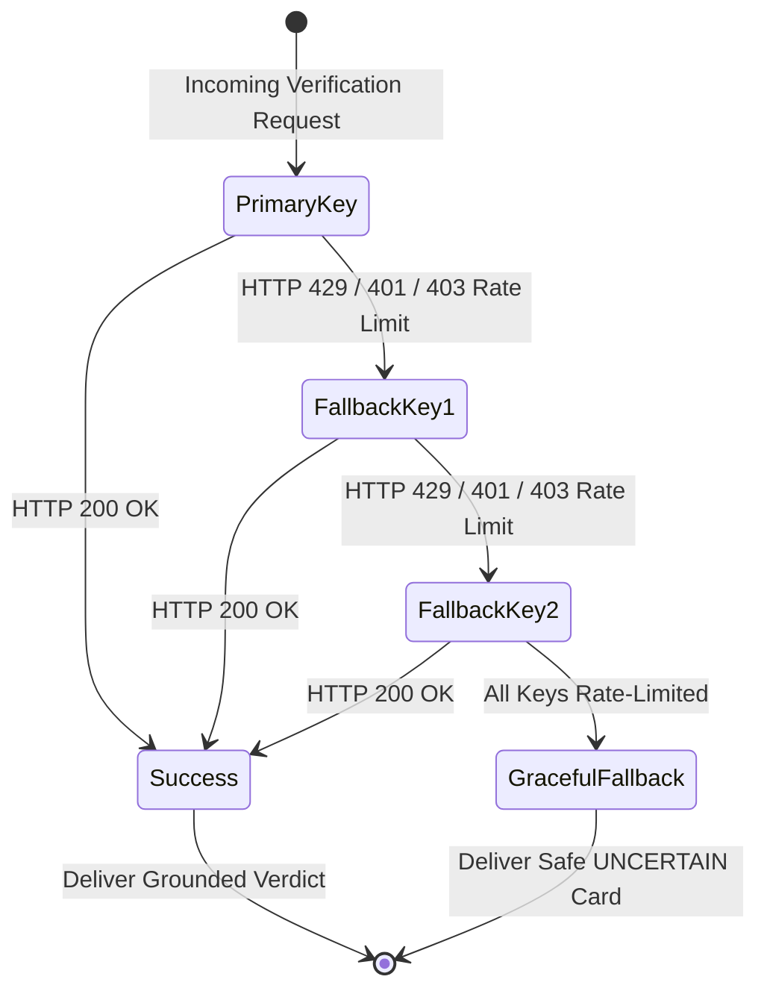
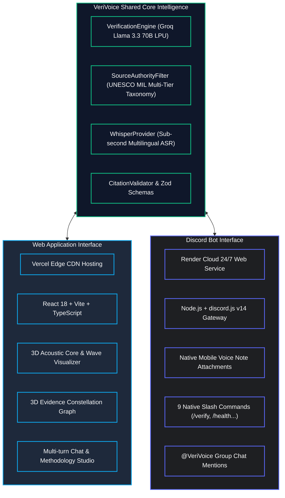

# VeriVoice Discord Bot — Architecture & Flow Diagrams

This document contains Mermaid diagrams and structural flowcharts representing the VeriVoice Discord Bot architecture.

---

## 1. High-Level Architecture Topology

---

## 2. Detailed Voice Note Audio Pipeline Sequence

---

## 3. Slash Command & Text Verification Flow

---

## 4. Multi-Layer Failure & Degradation Tree

---

## 5. Security & Input Sanitization Architecture

---

## 6. Multi-Tenant Session & Channel Isolation Model

---

## 7. Groq Multi-Key Quota Protection & Failover Pool

---

## 8. VeriVoice Ecosystem: Discord vs. Web Application

